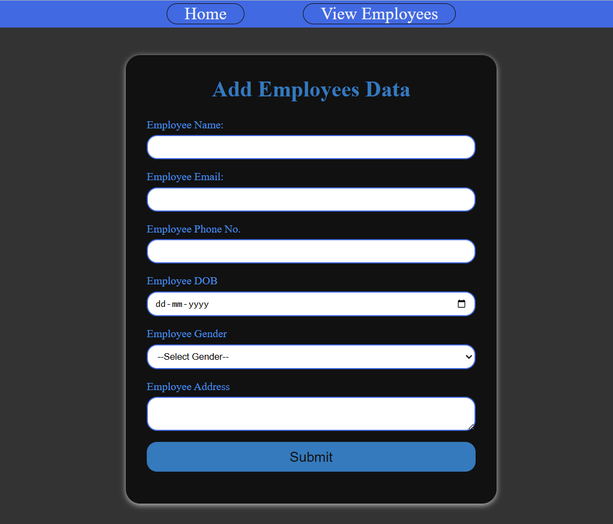

<div align="center">


<br/>


<br/>

[](https://opensource.org/licenses/MIT)


<br/>

> **A full-stack Employee Management System** built with Python Flask, SQLAlchemy ORM, and MySQL — featuring complete CRUD operations with a clean, responsive UI.

<br/>

[🚀 Features](#-features) • [🛠 Tech Stack](#-tech-stack) • [⚡ Quick Start](#-quick-start) • [📁 Project Structure](#-project-structure) • [📸 Screenshots](#-screenshots) • [🤝 Contributing](#-contributing)

</div>

---

## 📸 Screenshots

<!-- > *(Add your app screenshots here — Home page, Add Employee form, Employee list, Edit page)* -->

| Home / Dashboard | Add Employee |
|:-:|:-:|
| `---------------` |  |

| Employee List | Edit Employee |
|:-:|:-:|
|  |  |

---

## 🚀 Features

- ✅ **Create** — Add new employees with name, department, role, and salary details
- 📋 **Read** — View all employees in a clean, organized table
- ✏️ **Update** — Edit any employee record instantly
- 🗑️ **Delete** — Remove employee records with confirmation
- 💾 **MySQL Database** — Persistent storage via SQLAlchemy ORM
- 🎨 **Clean UI** — Responsive design built with Jinja2 + CSS

---

## 🛠 Tech Stack

| Layer | Technology |
|-------|-----------|
| **Backend** | Python 3, Flask |
| **Frontend** | Jinja2 Templates, CSS3 |
| **ORM** | SQLAlchemy |
| **Database** | MySQL (via MySQL Connector) |
| **Server** | Flask Development Server |

---

## 📁 Project Structure

```
employee-manager/
│
├── main.py                  # Main Flask application & routes
├── db/
|   ├── __init__.py
|   ├── db_pool.py          # SQLALchemy and MySql+Connector+Python
|   ├── models.py           # SQLAlchemy Employee model
|   ├── repository.py       # SQLAlchemy Queries
├── requirements.txt        # Python dependencies
├── .env                    # Environment variables (not committed)
├── .gitignore
│
├── templates/              # Jinja2 HTML templates
│   ├── base.html           # Base layout template
│   ├── home.html           # Add employee form
│   ├── views_employees.html# Employee list page
│   └── view_emp.html       # Edit employee data
│
└── static/
    └── css/
        └── style.css       # Custom stylesheet
```

---

## ⚡ Quick Start

### Prerequisites

Make sure you have the following installed:
- Python 3.8+
- MySQL Server
- pip

### 1. Clone the repository

```bash
git clone https://github.com/Md-Danyal/Employee-Manager-Flask-Web-App
cd employee-manager
```

### 2. Create a virtual environment

```bash
python -m venv venv

# Windows
venv\Scripts\activate

# macOS/Linux
source venv/bin/activate
```

### 3. Install dependencies

```bash
pip install -r requirements.txt
```

### 4. Set up the database

```sql
-- Run in MySQL
CREATE DATABASE employee_db;
```

### 5. Configure environment variables

Create a `.env` file in the root directory:

```env
DB_HOST=localhost
DB_USER=root
DB_PASSWORD=your_password
DB_NAME=employee_db
SECRET_KEY=your-secret-key-here
```

### 6. Run the app

```bash
python main.py
```

Visit 👉 `http://127.0.0.1:5000`

---

## 🔧 CRUD Operations

| Operation | Route | Method | Description |
|-----------|-------|--------|-------------|
| Read all | `/` | GET | View all employees |
| Create | `/add` | GET, POST | Add new employee |
| Update | `/edit/<id>` | GET, POST | Edit employee |
| Delete | `/delete/<id>` | POST | Remove employee |

---

## 📦 Requirements

```txt
Flask
Flask-SQLAlchemy
mysql-connector-python
python-dotenv
```

Generate with:
```bash
pip freeze > requirements.txt
```

---

## 🤝 Contributing

Contributions are welcome! Feel free to:

1. Fork the project
2. Create your feature branch (`git checkout -b feature/AmazingFeature`)
3. Commit your changes (`git commit -m 'Add some AmazingFeature'`)
4. Push to the branch (`git push origin feature/AmazingFeature`)
5. Open a Pull Request

---

## 📄 License

This project is licensed under the MIT License — see the [LICENSE](LICENSE) file for details.

---

<div align="center">

Made with ❤️ by Md-Danyal using Python & Flask

⭐ **Star this repo if you found it helpful!** ⭐

</div>
